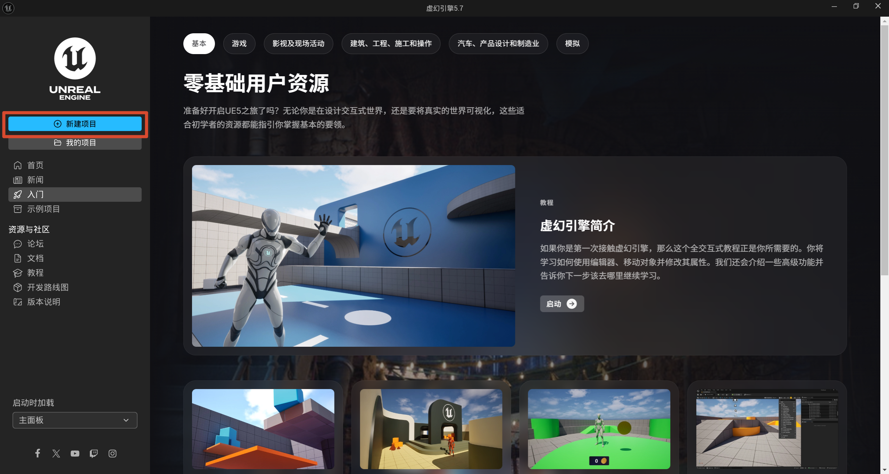
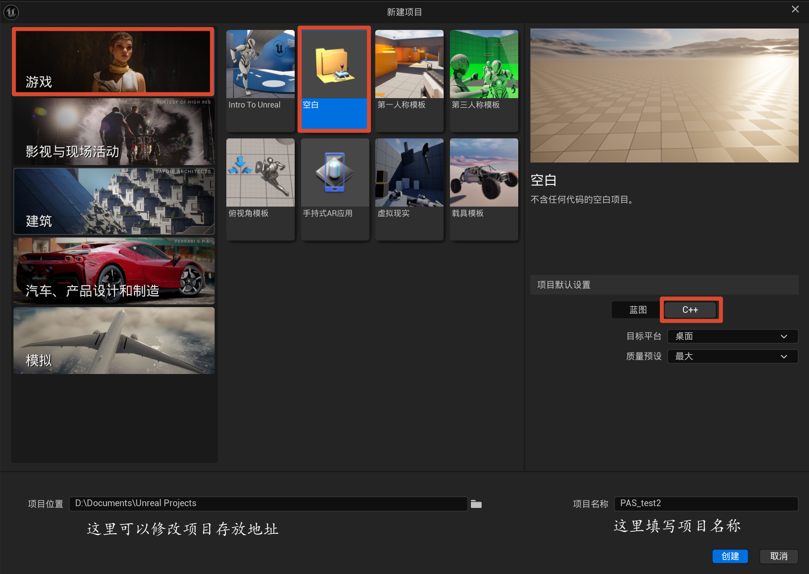
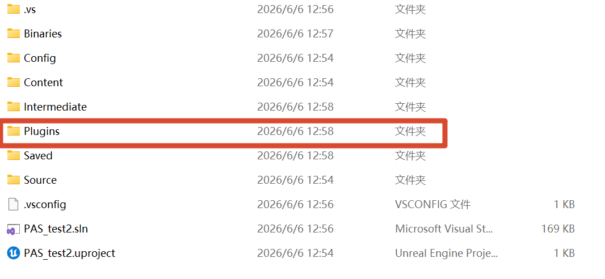
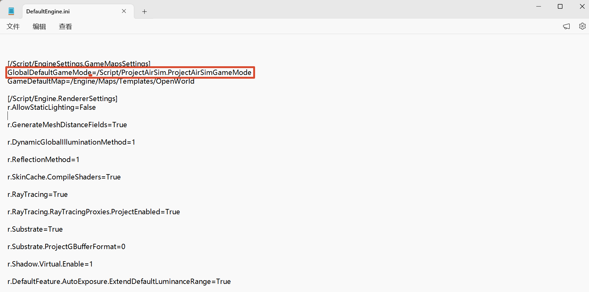
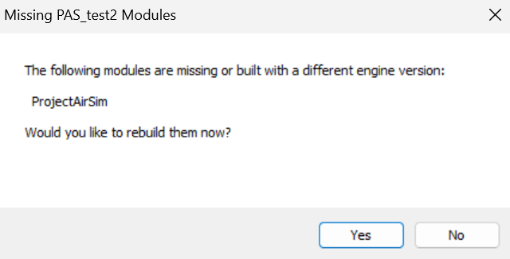
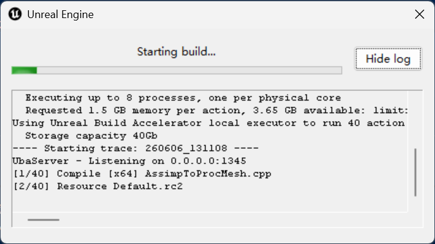
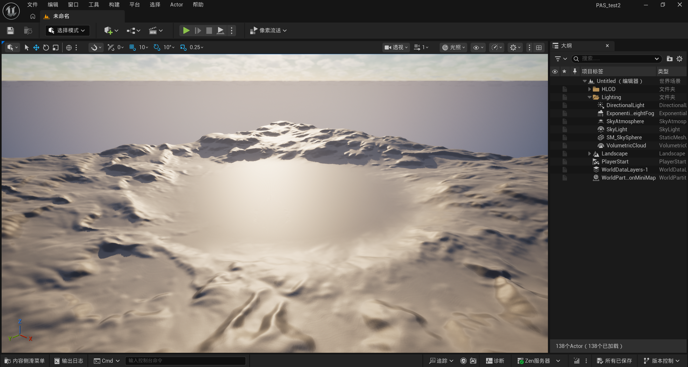
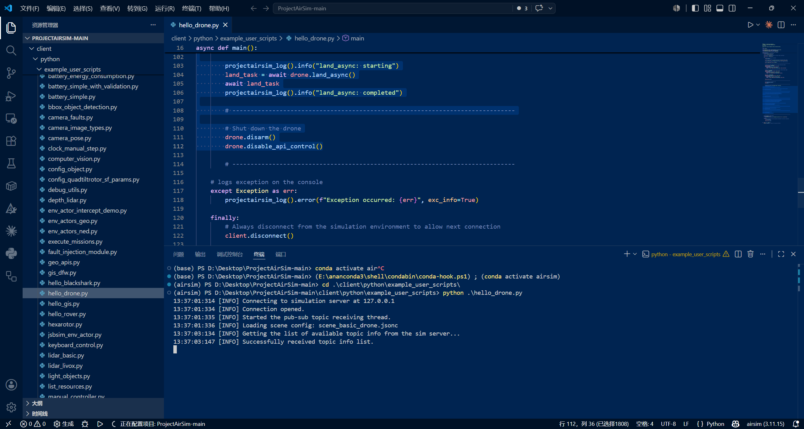
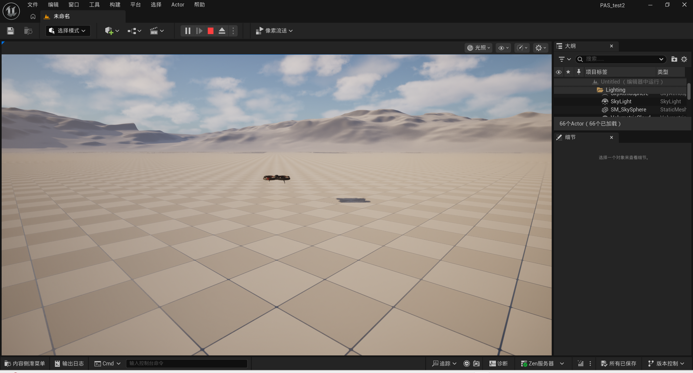
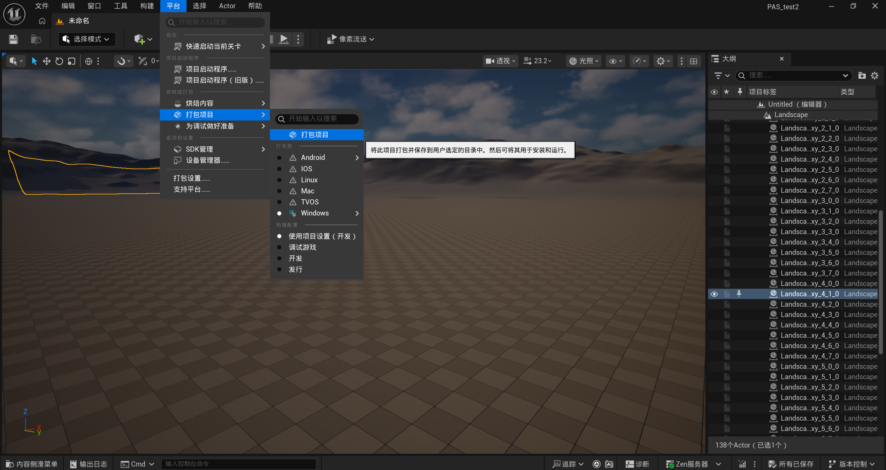

<!--more-->

# 动机
由于客观上任务的需要，我需要将[ProjectAirSim](https://github.com/iamaisim/ProjectAirSim)在UE5.7中做插件作为插件使用以便于搭建自己的场景，当然他有[官方说明文档](https://iamaisim.github.io/ProjectAirSim/use_plugin.html),但是我觉得说的不是很清晰而且示例版本比较老了。这是我提供的[预编译好的包](https://1859730198.share.123865.com/123pan/Mb4ivd-OBRaA?pwd=LrEu#)。(其实我不希望用网盘传输的但是我找不到更好的方法，如果你有好的建议欢迎告诉我)

# 第一步
打开虚幻引擎 创建项目

配置项目具体设置如下

# 第二步
将编译好的包放在所创建项目的根目录下

修改`Config\DefaultEngine.ini`的内容 
```python
[/Script/EngineSettings.GameMapsSettings]
GlobalDefaultGameMode=/Script/ProjectAirSim.ProjectAirSimGameMode
```

接着回到根目录双击`PAS_test2.uproject`(或者你用虚幻引擎打开是一样的),提示要你重编译一下，点yes


漫长的等待



当当当当，编译好后他会自动打开下面的页面


按照[官方说明文档](https://iamaisim.github.io/ProjectAirSim/use_plugin.html)中的说明，我们还需要进行一些其他的设置，比如说设置游戏模式但是我没找到这个选项卡所以就算了

# 第三步
回到PAS的工程界面（这个python环境的配置[参考](https://iamaisim.github.io/ProjectAirSim/development/use_prebuilt.html)），运行`hello_drone.py`



看见无人机已经可以正常工作了



然后就是打包，谨慎起见我参考了[官方说明文档](https://iamaisim.github.io/ProjectAirSim/use_plugin.html)中的设置，编辑`Config\DefaultGame.ini`
```python
[/Script/UnrealEd.ProjectPackagingSettings]
bCookAll=True
```


完结撒花！随着我学习的深入会接着发布后续内容（maybe）

